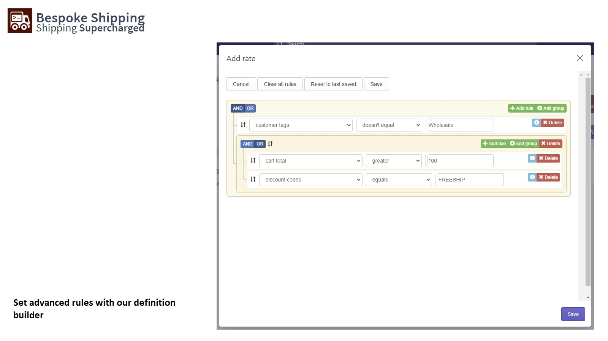

# shopify_custom_delivery
Shopify app for non-plus plan store
## Reference app

## Use cases
    - Customer tags contains 'b2b' : show specific shipping rate for 'b2b' tagged customer along with all other shipping rates.
        
    - Customer tags does not contains 'b2b' : show shipping rates except for 'b2b' tagged customer shipping rate.

    - 
## Requirments
    - Create custom shipping rate in general profile under Shipping and Delivery
    -

